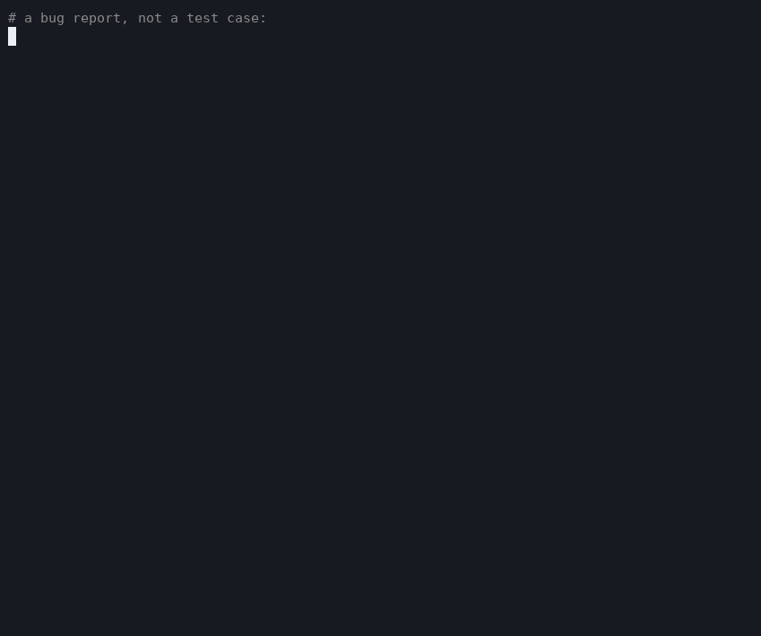

# repro

**Turn any bug report into a reproduction your coding agent can run.**



Coding agents are good at fixing bugs and bad at reproducing them. Given
*"checkout sometimes fails after I change my address and apply a coupon"*, an
agent will read some code, guess, patch something plausible, and declare victory
without ever having seen the bug happen.

`repro` supplies the missing step. It turns a bug report into an executable
scenario, proves the failure happens, measures how often, cuts it down to the
steps that matter, and hands the agent an objective signal to work against:

```
$ repro run --json
{ "status": "reproduced", "reproduction_rate": 1.0, ... }
```

Fix the bug. Run it again. `"status": "not_reproduced"` means done — not "the
model thinks it's done".

repro is not another coding agent. It is the reproduction layer underneath
whichever one you use.


## Contents

- [Why](#why)
- [Install](#install)
- [Quick start](#quick-start)
- [The spec](#the-spec)
- [Commands](#commands)
- [Spec reference](#spec-reference)
- [Agent integration](#agent-integration)
- [Evidence](#evidence)
- [Try it](#try-it)
- [Design principles](#design-principles)
- [Non-goals](#non-goals)
- [Development](#development)


## Why

Bug fixing starts with reproduction. Humans know this:

```
report -> reproduce -> understand -> fix -> verify
```

Agents skip the second step, because it is the hardest one to do from a text
prompt. Without a reproduction there is no strong definition of "fixed", and no
answer to any of the questions that matter:

- Did anything ever actually fail?
- Under exactly which conditions?
- Was it intermittent, and is it still?
- Did the change eliminate those conditions, or something nearby?
- Can a second person confirm it?
- Can it become a regression test?

repro answers all of those by making the bug executable.

```
Bug report
    |
    v
  repro          understands the repo, builds the environment,
    |            constructs the scenario, reproduces the failure,
    |            captures evidence, minimizes the reproduction
    v
Executable reproduction
    |
    v
Coding agent -> inspect -> fix -> repro run -> bug no longer reproduces
```


## Install

```bash
npm i -D repro
```

Browser steps additionally need Playwright:

```bash
npm i -D playwright && npx playwright install chromium
```

Requires Node 20 or newer.


## Quick start

```bash
repro init "Checkout returns 500 after changing the shipping address and applying SAVE20"
```

repro reads the repository — framework, package manager, start command, port,
database, setup scripts — and writes:

```
.repro/
├── repro.yaml     the reproduction spec (commit this)
├── COMPILE.md     briefing for your coding agent
├── report.md      the original bug report, when one was imported
├── fixtures/
├── scripts/
└── runs/          evidence bundles, one per run
```

`repro.yaml` arrives complete except for the scenario, because the scenario is
the one thing that cannot be read off disk. Point your agent at `COMPILE.md`; it
writes the steps and iterates on `repro run` until the bug fails on demand.

There is no model inside repro. No API key, no vendor, no hidden inference —
whichever agent you already use does the writing, and repro does the executing.
That is what keeps the same `repro.yaml` runnable by Claude Code, Codex, Aider,
CI, and a human at a terminal.


## The spec

```yaml
name: checkout-address-coupon
base_url: http://localhost:3000

setup:
  - shell: npm run db:reset
  - shell: npm run seed

services:
  - command: npm run dev
    wait_for: { http: http://localhost:3000/health }

scenario:
  - name: create session
    http: { method: POST, url: /api/session }
    expect: { status: 201 }
    save: { sid: $.session }

  - name: set shipping address
    http:
      method: PUT
      url: /api/shipping-address
      headers: { x-session: "${sid}" }
      json: { country: US, state: CA }
    expect: { status: 200 }

  - name: change shipping address
    http:
      method: PUT
      url: /api/shipping-address
      headers: { x-session: "${sid}" }
      json: { state: WA }
    expect: { status: 200 }

  - name: apply coupon
    http:
      method: POST
      url: /api/coupon
      headers: { x-session: "${sid}" }
      json: { code: SAVE20 }
    expect: { status: 200 }

  - name: checkout
    http: { method: POST, url: /api/checkout, headers: { x-session: "${sid}" } }

failure:
  step: checkout
  expect: { status: 200 }
  reproduce:
    status: 500
    exception: Cannot read properties of null
```

Two rules carry more weight than they look like they do.

**`failure.reproduce` defines "reproduced".** Make it specific. `{status: 500}`
on its own will happily match an unrelated crash and send your agent chasing it.

**An `expect` on a step before the failure step is a precondition.** If it fails,
the run is reported as an *error*, not as a reproduction. That is what stops a
broken login from masquerading as the bug — and what stops the minimizer from
deleting the login step.


## Commands

### repro run

```
$ repro run
REPRO checkout-address-coupon
Environment         PASS
Services            PASS
Scenario            PASS

FAILURE REPRODUCED
Step:
  checkout
Expected:
  200
Observed:
  500
Exception:
  Cannot read properties of null (reading 'toUpperCase')
Reproduction:
  1 / 1 runs
Confidence:
  HIGH
Evidence:
  .repro/runs/0007/
```

When the bug does not reproduce, repro says which clause failed to match rather
than just printing a verdict:

```
NOT REPRODUCED
Why not:
  status 200 != 500
  no exception containing "Cannot read properties of null"
```

### repro run --repeat N

Reproducibility is a measurement, not a yes/no.

```
Runs:
  20 total
  17 reproduced
  3 passed
Reproduction rate:
  85%
Classification:
  FLAKY
Confidence:
  HIGH
```

| rate | classification |
| --- | --- |
| 100% | DETERMINISTIC |
| 50-99% | FLAKY |
| 1-49% | RARE |
| 0% | NOT REPRODUCED |

Confidence describes the measurement, not the bug: one green run says very
little, twenty consistent runs say a lot. After a fix, run it a few hundred
times and see whether the rate actually moved.

Services start once per invocation and setup steps run before each iteration, so
`--repeat 20` does not mean twenty dev-server boots. Set `restart_services: true`
when a run must not inherit any process state.

### repro minimize

Drops steps and re-runs. A step survives only if removing it stops the bug.

```
$ repro minimize
Original:
  12 steps
Reducing:
  12 -> 11 -> 10 -> 9 -> 8 -> 7 -> 6 -> 5
Minimal reproduction:
   1. create session
   2. set shipping address to CA
   3. change shipping address to WA
   4. apply coupon SAVE20
   5. checkout
Failure reproduced:
  3 / 3
Probes:
  23 runs
```

An 18-step user journey becomes four API calls, and the agent's search space
shrinks with it. Instead of "understand this checkout system", the instruction
becomes "the failure needs an address mutation followed by a coupon".

Writes `.repro/<name>.min.yaml` by default; `--write` replaces the spec and keeps
the original alongside. `--confirm N` requires N reproductions before accepting a
removal, which matters for flaky bugs. Mark a step `keep: true` to protect it.

### repro explain

Not a root-cause claim — evidence about where behaviour diverges, gathered by
running things.

```
Failure boundary identified.
Failure observed at:
  checkout
Failure becomes observable after:
  apply coupon SAVE20
Required steps:
  create session, set shipping address to CA,
  change shipping address to WA, apply coupon SAVE20, checkout
Not required:
  health check, browse products, add widget to cart, open cart, ...
State difference (caused by the boundary step):
  GET /api/cart $.cart.tax_region
    before: "WA"
    after:  null
Ignored as run-to-run noise:
  $.cart.id, $.session
Relevant code paths:
  src/tax.mjs:4
  server.mjs:96
```

Three things are happening here, all deterministic:

1. **Necessity.** Each step is dropped in turn to see whether the bug survives.
2. **State probing.** The scenario's read-only requests are replayed with and
   without the boundary step, so the difference is caused by that step alone.
3. **Noise subtraction.** Fields that differ between two *identical* runs —
   session ids, timestamps, order numbers — are measured first and removed, so
   they cannot be mistaken for causal change.

repro deliberately stops short of naming a cause. Its job is to hand the agent a
much smaller haystack.

### repro from

```bash
repro from issue.md
repro from production.log
repro from request.curl
repro from checkout.har
```

- **HAR** becomes HTTP steps, with assets stripped and everything recorded after
  the failing request dropped.
- **curl** commands are parsed flag by flag, including `-X`, `-H`, `-d`, `-b`,
  `-u` and `--data-raw`.
- **Free text** gives up its stack traces, error messages, embedded curl
  commands, and `POST /api/checkout 500` log lines.

Repeated requests are kept: *"I changed the address twice"* is usually the whole
bug. Anything repro could not parse is preserved in `.repro/report.md` for the
agent to read, and every guess it had to make is printed as a note.

### repro bisect

Once a reproduction exists, it is a git primitive.

```
$ repro bisect --good v2.4.1 --bad HEAD
Regression introduced by:
  a913de7
  refactor checkout pricing state
```

The spec is copied outside the working tree first — a spec that time-travels with
the checkout is not the same predicate. `--repeat N` makes each commit's verdict
more robust for flaky failures.

### repro export --test

Turns a fixed bug into a permanent regression test, so the bug report becomes a
durable engineering asset instead of disappearing when the issue closes. Detects
vitest or jest, falling back to `node:test`.

```
Bug report -> reproduction -> minimized -> agent fix -> no longer reproduces -> regression test
```


## Spec reference

### Top level

| key | meaning |
| --- | --- |
| `name` | identifier for the reproduction (required) |
| `description` | human summary of the bug |
| `base_url` | prefix for relative `http.url` and browser `goto` targets |
| `env` | environment variables for services and shell steps |
| `vars` | initial values for `${interpolation}` |
| `setup` | steps run before services start, on every iteration |
| `services` | long-running processes to supervise |
| `scenario` | the reproduction steps (required) |
| `failure` | what counts as reproduced (required) |
| `teardown` | steps run after the scenario, always |
| `restart_services` | restart services between repeated runs |
| `stop_on_expect_fail` | abort the scenario at the first failed `expect` |

### Steps

| kind | example |
| --- | --- |
| `shell` | `- shell: npm run seed` with optional `cwd` |
| `http` | `- http: { method, url, headers, json / body / form, timeout_ms }` |
| `browser` | `- browser: [ { goto: / }, { click: "#buy" } ]` |
| `sleep` | `- sleep: 250` |

Every step also accepts `id`, `name`, `expect`, `keep`, and `save`.
`save: { sid: $.session }` captures a value from the response for use as
`${sid}` later; `${env.NAME}` reads the environment.

### Browser actions

`goto`, `click`, `fill`, `type`, `select`, `press`, `wait_for`, `wait`,
`wait_for_text`, `expect_text`, `expect_visible`, `screenshot`, `eval`.

Selector/value actions accept either form:

```yaml
- fill: { selector: "#coupon", value: SAVE20 }
- fill: ["#coupon", SAVE20]
```

### Matchers

Used by `expect`, `failure.expect` and `failure.reproduce`. Every declared field
must hold.

| field | matches |
| --- | --- |
| `status` | exact HTTP status |
| `status_in` | status in a list |
| `status_not` | any status but this one |
| `body_contains` | substring of the response body |
| `body_matches` | regular expression against the body |
| `json` | map of `$.json.path` to expected value |
| `exception` | substring of the error message or stack |
| `exit_code` | shell exit code |
| `stdout_contains` / `stderr_contains` | shell output |
| `logs_contain` | substring of the service or browser logs |

### Services

```yaml
services:
  - name: app
    command: npm run dev
    cwd: .
    env: { NODE_ENV: test }
    wait_for:
      http: http://localhost:3000/health   # or: port: 3000, or: log: "listening on"
      timeout_ms: 60000
```

Services are started as process groups and killed as process groups. Dev servers
routinely fork children, and killing only the shell leaves the port bound so the
next run silently talks to a stale process.


## Agent integration

Any assistant that can run a shell command can use repro:

> Fix the bug. Use `repro run --json` to reproduce it.
> Keep working until the reproduction no longer fails.

```json
{
  "status": "reproduced",
  "name": "checkout-address-coupon",
  "reproduction_rate": 1.0,
  "classification": "DETERMINISTIC",
  "confidence": "HIGH",
  "runs": 1,
  "failures": 1,
  "successes": 0,
  "failure": {
    "step": "checkout",
    "step_index": 12,
    "expected_status": 200,
    "actual_status": 500,
    "exception": "Cannot read properties of null (reading 'toUpperCase')",
    "mismatch": []
  },
  "artifacts": [".repro/runs/0007/result.json", ".repro/runs/0007/network.json"]
}
```

Every command takes `--json`. `repro run --exit-code` follows the git bisect
contract: `0` good, `1` reproduced, `125` untestable.

repro is also importable as a library:

```js
import { loadSpec, runReproduction, minimize, explain } from 'repro'

const loaded = await loadSpec()
const result = await runReproduction(loaded, { repeat: 20 })
```


## Evidence

A reproduction should produce more than PASS or FAIL. Every run leaves a bundle
behind:

```
.repro/runs/0011/
├── result.json       verdict, per-step observations, timings
├── network.json      every request and response
├── service.log       this run's slice of the application's output
├── browser.log       console messages and page errors
├── screenshots/      including an automatic one at the failing action
└── trace.zip         Playwright trace (--trace)
```

`.repro/runs/latest` always points at the most recent run.


## Try it

The repository ships a small shop with a genuine checkout bug: writing the
shipping address twice makes the coupon endpoint restore a stale pricing
snapshot, which nulls the tax region, which crashes checkout.

```bash
git clone git@github.com:sajjadriaj/repro.git
cd repro && npm install && npm run build
cd example

node ../dist/cli.js run                             # reproduces
node ../dist/cli.js run --repeat 10                 # deterministic
node ../dist/cli.js minimize                        # 12 steps -> 5
node ../dist/cli.js explain                         # boundary and state diff
node ../dist/cli.js run --spec .repro/browser.yaml  # same bug through the UI
```

Set `FLAKY_RATE=0.7` on the example server to watch `--repeat` classify an
intermittent failure.


## Design principles

**Reproduction before diagnosis.** Can we make it fail? Can we make it fail
consistently? Can we make it smaller? Only then, why.

**Deterministic where possible.** A model is useful for turning prose into a
candidate scenario. Deciding whether the bug reproduced is not a judgement call,
so nothing in the execution path is one.

**Agent independent.** No dependency on a particular model, assistant or IDE.

**Human inspectable.** The spec is a YAML file you can read, edit and review.
There is no hidden state.

**Evidence over claims.** Not "I think I reproduced it" — `20/20 runs`, a trace,
and a diff.


## Non-goals

repro is not a coding agent, a general-purpose testing framework, a Playwright
replacement, a unit test replacement, a CI platform, an observability platform,
or an agent orchestrator. It has one responsibility: turn bugs into executable
reproductions.


## Development

```bash
npm install
npm run build
npm test          # 26 tests, including end-to-end reproduce/minimize/explain
bash docs/demo.sh # regenerate the demo recording
```

The MVP targets JavaScript and TypeScript web applications; the execution layer
is deliberately separated from the ecosystem so others can be added.


## License

MIT
