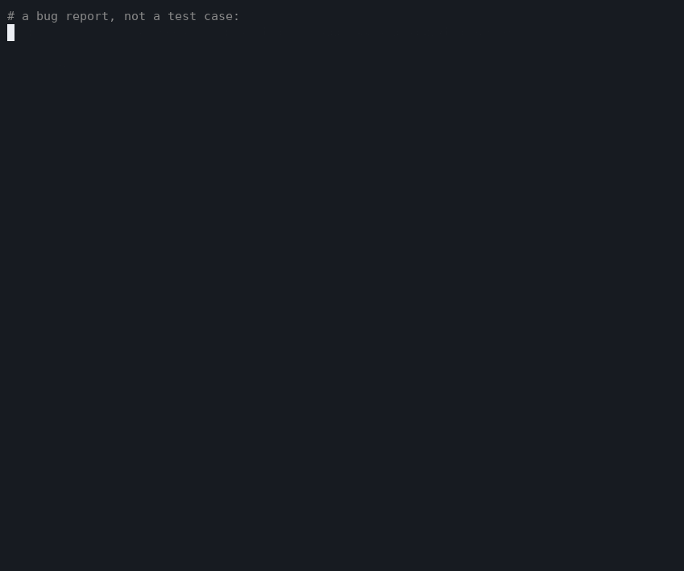

<h1 align="center">repro</h1>

<p align="center"><strong>Turn any bug report into a reproduction your coding agent can run.</strong></p>

<p align="center">
  <a href="#install">Install</a> ·
  <a href="#quick-start">Quick start</a> ·
  <a href="#agents-too">Agents</a> ·
  <a href="docs/README.md">Docs</a> ·
  <a href="example/">Example</a>
</p>

<p align="center">
  
  
  
</p>



Coding agents are good at fixing bugs and bad at reproducing them. Given
*"checkout sometimes fails after I change my address and apply a coupon"*, an
agent reads some code, guesses, patches something plausible, and declares
victory without ever having seen the bug happen.

repro supplies the missing step. It turns the report into an executable
scenario, proves the failure happens, measures how often, cuts it down to the
steps that matter, and hands the agent an objective signal to work against:

```
$ repro run --json
{ "status": "reproduced", "reproduction_rate": 1.0, ... }
```

Fix the bug. Run it again. `"status": "not_reproduced"` means done — not "the
model thinks it's done".

```
bug report → reproduction → minimized → sealed → agent fix → verified → regression test
```

There is no model inside repro: no API key, no vendor, no hidden inference. The
agent you already use writes the scenario, repro executes it, and the same
`repro.yaml` runs under Claude Code, Codex, Aider, CI, or a human at a terminal.


## Install

```bash
npm i -D repro
```

Node 20 or newer. Browser steps also need `npm i -D playwright && npx playwright install chromium`.


## Quick start

```bash
repro init "Checkout returns 500 after changing the shipping address and applying SAVE20"
repro run                       # reproduce it; evidence lands in .repro/runs/
repro run --repeat 20           # measure it: rate, 95% interval, DETERMINISTIC / FLAKY / RARE
repro minimize                  # 18 steps → the 5 that matter
repro establish && repro seal   # freeze the definition of the bug before anyone touches the code
repro verify                    # after the fix: did the rate move, under an unchanged contract?
repro export --test             # retire it into your own test suite
```

`init` reads the repository and writes `.repro/repro.yaml` complete except for
the scenario, plus a `COMPILE.md` briefing your agent iterates on until the bug
fails on demand. The spec is plain YAML:

```yaml
name: checkout-address-coupon
services:
  - command: npm run dev
    wait_for: { http: http://localhost:3000/health }

scenario:
  - http: { method: POST, url: /api/session }
    save: { sid: $.session }
  - http: { method: PUT, url: /api/shipping-address, headers: { x-session: "${sid}" }, json: { state: WA } }
  - http: { method: POST, url: /api/coupon, headers: { x-session: "${sid}" }, json: { code: SAVE20 } }
  - name: checkout
    http: { method: POST, url: /api/checkout, headers: { x-session: "${sid}" } }

failure:
  step: checkout
  reproduce: { status: 500, exception: Cannot read properties of null }
```

`failure.reproduce` defines "reproduced". Every `expect` before that step is a
precondition: if one fails the run is `invalid`, never a pass. Four outcomes,
not two — `reproduced`, `not_reproduced`, `invalid`, `error`.

→ [The spec, key by key](docs/spec.md)


## Commands

| command | what it does |
| --- | --- |
| `repro init "<bug>"` | inspect the repo and scaffold `.repro/repro.yaml` |
| `repro from <file>` | the same, seeded from a bug report, HAR, curl, log or agent trace |
| `repro run [--repeat N]` | execute the reproduction; report a verdict, a rate and a coverage checklist |
| `repro minimize` | drop every step whose removal does not stop the bug |
| `repro explain` | locate the failure boundary, the state it changes, and where trajectories diverge |
| `repro establish` / `repro seal` | measure the baseline, then freeze contract, baseline and environment |
| `repro verify` | re-run the sealed contract after the fix and compare against the interval |
| `repro status` | has the contract moved? answered from files, no application boot |
| `repro hook --install` | the completion gate: a Claude Code Stop hook that runs the reproduction |
| `repro bisect --good <ref> --bad <ref>` | the commit that introduced the failure |
| `repro export --test` | a regression test for vitest, jest or `node:test` |

Every command takes `--json`. `repro run --exit-code` follows the git bisect
contract (`0`, `1`, `125`). `--worktree <ref>` runs the same contract against
another commit.

→ [Command reference](docs/commands.md)


## Agents too

An agent bug is the same contract with a different observation: the step prints
a trace, and the matcher reads the trajectory instead of a status code.

```yaml
scenario:
  - id: request
    agent:
      run: node agents/support.mjs
      input: { message: Please refund order 123 }

failure:
  step: request
  reproduce:
    trace:
      tool_call: { name: refund_order }
      sequence: { not_preceded_by: { tool: get_order } }
```

*The agent refunded without ever looking the order up.* Any process that prints
JSON events qualifies; Claude Code's stream is recognized by shape. Wrong tool,
wrong MCP server, wrong arguments, looping, cost, malformed output, the wrong
file edited — all matchable. A 30% bug is still a bug: `--repeat` measures it,
`seal` freezes the rate, `verify` says whether it moved and where the fixed agent
left the bug path.

→ [Agent reproduction](docs/agents.md)


## Wire it into the loop

> Fix the bug. Use `repro run --json` to reproduce it.
> Keep working until the reproduction no longer fails.

Better: stop asking the agent to police itself. `repro establish && repro seal`
before the fix, so the goalposts cannot move; `repro hook --install` so the
agent cannot stop while the bug still reproduces.

→ [The loop, step by step](docs/getting-started.md#the-loop)


## Try it

```bash
git clone git@github.com:sajjadriaj/repro.git && cd repro
npm install && npm run build && cd example
node ../dist/cli.js run                            # a real checkout bug
node ../dist/cli.js run --spec .repro/agent.yaml   # a support agent that refunds twice
```

→ [More to try](docs/getting-started.md#try-the-example)


## Documentation

| | |
| --- | --- |
| [Getting started](docs/getting-started.md) | install, the first reproduction, the agent loop, the example |
| [The spec](docs/spec.md) | every key, step kind, matcher and comparator |
| [Commands](docs/commands.md) | `run` through `export`, with their output and options |
| [Agent reproduction](docs/agents.md) | traces, MCP, the two layers, record and replay, Claude Code |
| [Evidence](docs/evidence.md) | the run bundle, the coverage checklist, the fingerprint |
| [Design](docs/design.md) | why, principles, non-goals, architecture notes |


## Principles

- **Reproduction before diagnosis.** Can we make it fail? Consistently? Smaller? Only then, why.
- **Deterministic where possible.** Deciding whether the bug reproduced is not a judgement call, so nothing in the execution path is one.
- **The contract outlives the implementation.** A seal makes any change to the definition of the bug visible instead of preventing it.
- **Evidence over claims.** Not "I think I reproduced it" — `20/20 runs`, a trace, and a diff.


## License

MIT
